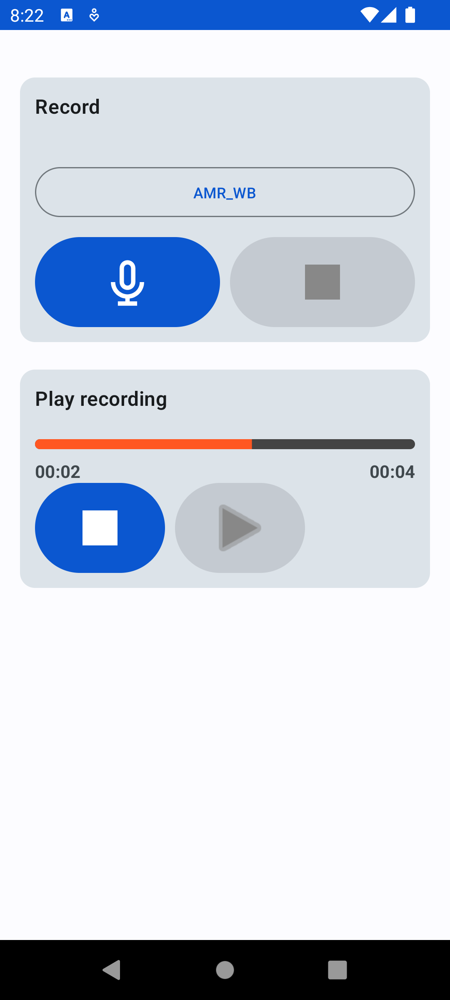

# Record Demo 

A small Android project to test the `MediaPlayer` ▶️ and `MediaRecorder` 🎙️. This project allows the user to create an audio recording by choosing a specific Audio Encoder. The user can play the recording as well.

### Use Cases

- Record an audio using a specific audio enconder;
- Stop recording;
- Play the recorded audio;
- Stop the recorded audio.

### Screenshot

